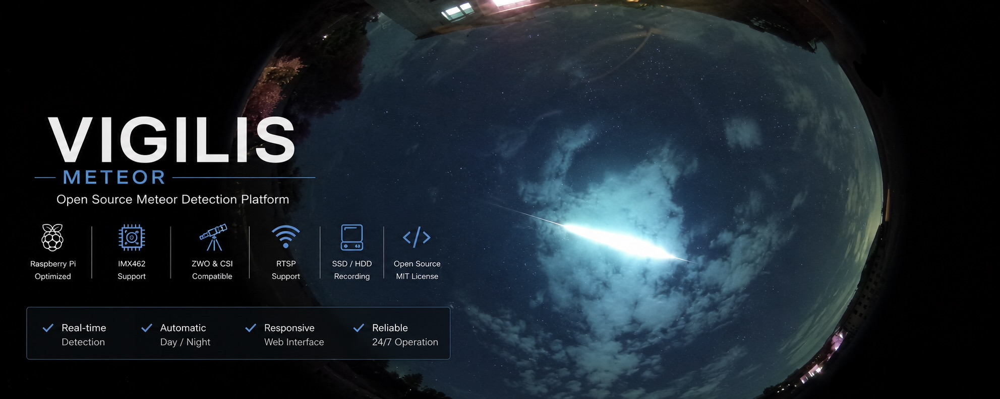

# Vigilis-Meteor

  

## ✨ Features

- ☄️ Real-time meteor detection
- 📷 CSI, ZWO and RTSP camera support
- 🌙 Automatic day/night settings
- 💾 SSD/HDD recording
- 🌐 Responsive web interface
- ⚡ Optimized for Raspberry Pi
- 🔄 Automatic updates
- 📊 Live system monitoring
- 🌌 Timelapse, Startrails & Ketograms

## Installation

1. Flash Raspberry Pi OS Bookworm (64-bit)
2. Download the latest VIGILIS release
3. Run the installer
4. Open the web interface
5. Enjoy 🙂

## Supported Hardware

### Raspberry Pi
- Raspberry Pi 4
- Raspberry Pi 5

### Cameras
- Sony IMX462 CSI (tested)
- CSI Cameras
- ZWO ASI Cameras
- RTSP Cameras

VIGILIS Meteor is an open-source meteor detection software for Raspberry Pi, designed for reliable 24/7 operation. It supports CSI, ZWO and RTSP cameras, offers automatic day/night settings, a responsive web interface, SSD/HDD recording and focuses on stability, image quality and detection accuracy.

## 📖 Documentation

The complete installation guide, hardware setup and troubleshooting manual can be found here:

📄 [VIGILIS Documentation (PDF)](./VIGILIS%20DOCUMENTATION.pdf)